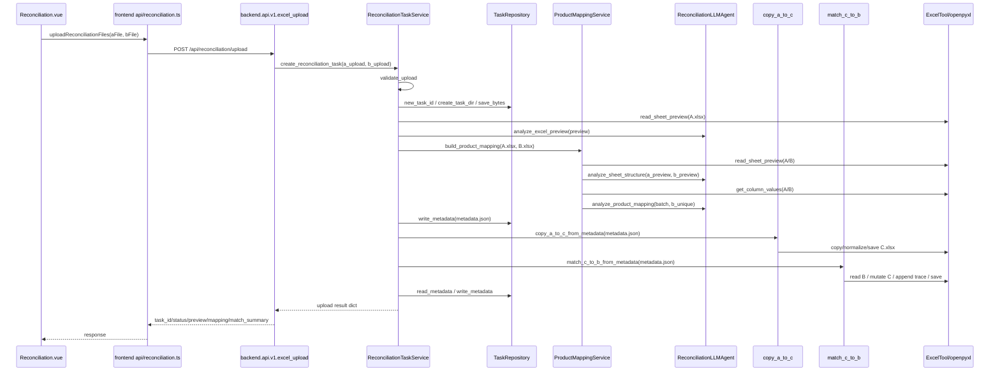

# 项目结构与函数调用链路

本文档基于当前代码结构整理，目标是说明系统模块边界、主要函数调用链路，以及从“大项目可维护性”角度看还需要继续收敛的位置。

## 1. 结构健康结论

当前项目已经具备中大型项目的基础分层：

- `frontend/`：Vue 前端工作台，负责文件选择、任务状态展示、结果下载。
- `backend/api/`：FastAPI HTTP 入口，负责请求校验、响应组装、异常转换。
- `backend/services/`：后端应用服务层，负责业务流程编排。
- `backend/domain/`：后端领域模型、LLM JSON 解析、结果投影。
- `agent/`：对账 agent 能力层，包含 LLM 门面、provider 适配器、prompt、Excel preview 画像、Excel workflow。
- `tools/`：通用 Excel 文件读写工具。
- `docker/`：容器构建、compose 编排、nginx 示例、部署说明。
- `tests/`：单元测试覆盖核心 Excel 工具、LLM adapter、商品映射服务和 C 表 workflow。

目前结构比之前更合理，`agent/llm.py` 和 `backend/services/product_mapping_service.py` 不再承载大量细节逻辑，prompt、解析、批处理、投影、Excel preview 打分已经拆出。

但如果按“大项目长期维护”的标准看，还没有完全到位。主要剩余问题：

- `backend/api/v1/excel_upload.py` 已经调整为薄接口，主要负责 FastAPI 参数接收和异常映射。上传任务编排已下沉到 `backend/services/reconciliation_task_service.py`，任务文件与 metadata 读写已下沉到 `backend/repositories/task_repository.py`。
- `agent/workflows/reconciliation/match_c_to_b.py` 接近独立引擎，函数很多，后续建议拆成 `b_records.py`、`c_columns.py`、`match_planner.py`、`c_writer.py`、`metadata.py`。
- `frontend/src/api/reconciliation.ts` 同时包含 API client、类型定义和 mock 数据。后续建议拆成 `api/reconciliation.ts`、`types/reconciliation.ts`、`mocks/reconciliation.ts`。
- `agent/llm.py` 为兼容旧测试和调用路径保留了一些转发方法。等上层导入稳定后，可以进一步把兼容方法下沉或删除。
- `scripts/run_reconciliation.py` 引用了当前不存在的 `agent.cli`，这是残留入口，后续要么补 CLI，要么删除该脚本。
- `requirements.txt` 当前同时包含运行依赖和测试/开发依赖。生产 Docker 镜像可以进一步拆成 `requirements.txt` 和 `requirements-dev.txt`。

结论：当前结构适合作为 MVP 到工程化版本的过渡形态，核心职责已经拆开；下一阶段应重点处理 `ReconciliationTaskService` 的进一步协作者拆分，以及 Excel workflow 长文件。

## 2. 当前模块边界

```text
frontend/
  src/
    views/Reconciliation.vue          # 用户发起上传和展示任务状态
    api/reconciliation.ts             # 调用后端 API、下载 URL、前端类型和 mock 数据
    components/                       # 展示组件

backend/
  main.py                             # FastAPI app、CORS、health check
  api/router.py                       # API router 汇总
  api/v1/excel_upload.py              # 上传、下载 HTTP 入口和异常映射
  config.py                           # 环境变量配置
  repositories/task_repository.py     # 任务目录、metadata、产物文件定位
  schemas/reconciliation.py           # API 响应结构转换
  services/reconciliation_task_service.py # 上传任务应用流程编排
  services/product_mapping_service.py # 商品映射应用服务编排
  services/product_mapping_batcher.py # 商品映射 LLM 分批调用和结果合并
  domain/product_mapping.py           # 商品映射领域数据结构
  domain/product_mapping_parser.py    # LLM JSON -> 领域对象
  domain/product_mapping_projection.py# 领域对象 -> A/B 匹配展示结构
  domain/json_parser.py               # 通用 LLM JSON 解析

agent/
  llm.py                              # LLM provider-neutral 门面
  prompts/reconciliation.py           # 对账相关 prompt 构造
  domain/config.py                    # LLM 配置模型
  domain/excel_profile.py             # Excel preview 列画像和相似度打分
  llm_providers/                      # Anthropic/OpenAI/DeepSeek/Qwen/Ollama 适配器
  workflows/reconciliation/           # C 表生成、C/B 匹配与反向核查

tools/
  excel_tool.py                       # Excel 通用读写、预览、清洗、写表工具

docker/
  backend.Dockerfile                  # 后端镜像
  frontend.Dockerfile                 # 前端 nginx 镜像
  docker-compose.yml                  # 前后端编排
  nginx.conf                          # 容器内 nginx，静态站点 + /api 反代
  nginx.host.example.conf             # 宿主机 nginx 反代示例
  DEPLOYMENT.md                       # Linux Docker 部署流程
```

## 3. HTTP 主流程调用链

用户在前端上传 A/B 表后，主流程是同步执行完整对账任务：上传文件、LLM 识别、商品映射、生成 C 表、匹配 B 表、返回结果。



### 3.1 前端上传链路

入口文件：

- `frontend/src/main.ts`
- `frontend/src/App.vue`
- `frontend/src/views/Reconciliation.vue`
- `frontend/src/api/reconciliation.ts`

调用顺序：

```text
main.ts
  -> createApp(App).mount("#app")

App.vue
  -> activeView = "workbench"
  -> <Reconciliation />

Reconciliation.vue
  -> FileUploadCard emits "change"
  -> changeFile(variant, file)
       - 保存 aFileObject / bFileObject
       - 更新 task.aFile / task.bFile 展示状态
  -> ReconciliationSettings emits "start"
  -> startReconciliation()
       - 设置 running/status/progress
       - 调用 uploadReconciliationFiles(aFileObject, bFileObject)

frontend/src/api/reconciliation.ts
  -> uploadReconciliationFiles(aFile, bFile)
       - new FormData()
       - fetch(`${API_BASE_URL}/api/reconciliation/upload`, POST)
       - 失败时解析 detail 并抛 Error
       - 成功时返回 UploadReconciliationResponse

Reconciliation.vue
  -> aPreview = response.a_preview
  -> llmAnalysis = response.llm_result
  -> productMapping = response.product_mapping
  -> finishTaskFromUploadResponse(response)
       - 汇总 match_summary
       - 更新 task.status / progress / metrics / coverage / downloads
```

### 3.2 后端上传入口链路

入口文件：`backend/api/v1/excel_upload.py`

```text
upload_excel(a_file, b_file)
  -> _read_upload(a_file)
       -> UploadedWorkbook(filename, content)
  -> _read_upload(b_file)
       -> UploadedWorkbook(filename, content)
  -> ReconciliationTaskService.create_reconciliation_task(a_upload, b_upload)
  -> 捕获 ReconciliationError
       -> _to_http_exception(exc)
```

应用服务入口：`backend/services/reconciliation_task_service.py`

```text
ReconciliationTaskService.create_reconciliation_task(a_upload, b_upload)
  -> validate_upload(a_upload, "A表")
  -> validate_upload(b_upload, "B表")
  -> TaskRepository.new_task_id()
  -> TaskRepository.create_task_dir(task_id)
  -> TaskRepository.save_bytes(A.xlsx, a_upload.content)
  -> TaskRepository.save_bytes(B.xlsx, b_upload.content)
  -> metadata = {...}

  -> analyze_a_sheet_with_llm(a_file_path)
       -> excel_tool.read_sheet_preview(a_file_path, rows=8, max_columns=12)
            -> ExcelTool.load_workbook()
            -> ExcelTool.get_sheet()
            -> ExcelTool.build_preview_cell()
            -> ExcelTool.trim_trailing_empty_cells()
       -> ReconciliationLLMAgent(...).analyze_excel_preview(preview)
            -> build_excel_preview_prompt(preview)
            -> complete(prompt)
            -> adapter.complete(prompt)
       -> parse_json_object(llm_response.text)
            -> backend.domain.json_parser.parse_json_object(text)
       -> 返回 preview, llm_result

  -> preview_to_response(preview)
  -> build_product_mapping(a_file_path, b_file_path)
       -> ProductMappingService(...).build_product_mapping(...)

  -> metadata["a_preview"] = ...
  -> metadata["llm_result"] = ...
  -> metadata["product_mapping"] = ...
  -> TaskRepository.write_metadata(metadata_path, metadata)

  -> copy_a_to_c_from_metadata(metadata_path)
  -> match_c_to_b_from_metadata(metadata_path)

  -> TaskRepository.read_metadata(metadata_path)
  -> latest_metadata["status"] = "SUCCESS"
  -> TaskRepository.write_metadata(metadata_path, latest_metadata)
  -> TaskRepository.latest_match_summary(latest_metadata)
  -> 返回前端 JSON
```

## 4. 商品映射调用链

商品映射由 `backend/services/product_mapping_service.py` 编排，细节分散在 domain、batcher、agent prompt 和 Excel profile 模块中。

```text
ProductMappingService.build_product_mapping(a_file_path, b_file_path)
  -> excel_tool.read_sheet_preview(A)
  -> excel_tool.read_sheet_preview(B)

  -> guess_product_fields(a_preview, b_preview)
       -> llm_agent.analyze_sheet_structure(a_preview, b_preview)
            -> ReconciliationLLMAgent.build_sheet_structure_prompt(...)
                 -> agent.prompts.reconciliation.build_sheet_structure_prompt(...)
                      -> build_column_profiles(a_preview)
                           -> collect_preview_columns(a_preview)
                      -> build_column_profiles(b_preview)
                           -> collect_preview_columns(b_preview)
                      -> build_b_spec_match_scores(a_preview, b_preview)
                           -> collect_preview_columns(A)
                           -> collect_preview_columns(B)
                           -> find_spec_column(B columns)
                           -> score_a_column_against_b_spec(A column, B spec values)
                                -> normalize_match_text(...)
                                -> text_similarity(...)
            -> ReconciliationLLMAgent.complete(prompt)
            -> provider adapter.complete(prompt)
       -> parse_json_object(llm_response.text)
       -> parse_field_guess(payload["a_sheet"])
       -> parse_field_guess(payload["b_sheet"])
       -> ProductStructureResult(...)

  -> validate_structure_result(structure_result)

  -> read_unique_product_values(A, a_field_name, header_row)
       -> excel_tool.get_column_values(...)
       -> excel_tool.unique_product_values(...)

  -> read_unique_product_values(B, b_field_name, header_row)
       -> excel_tool.get_column_values(...)
       -> excel_tool.unique_product_values(...)

  -> analyze_product_mapping_in_batches(a_unique, b_unique)
       -> ProductMappingBatchAnalyzer.analyze(...)
            -> chunk_list(a_unique, PRODUCT_MAPPING_BATCH_SIZE)
            -> llm_agent.analyze_product_mapping(a_batch, b_candidates)
                 -> build_product_mapping_prompt(a_batch, b_candidates)
                 -> complete(prompt, max_tokens=40960)
                 -> provider adapter.complete(prompt)
            -> parse_product_mapping_result(llm_response.text)
                 -> parse_json_object(text)
                 -> parse_normalization_rules(...)
                 -> parse_mapping_items(...)
                 -> parse_review_items(...)
            -> 合并 mappings / need_review / unmatched_a / unmatched_b

  -> build_a_b_intersection(a_unique, b_unique, mapping_result)
  -> 返回 structure、a_unique、b_unique、a_b_intersection、result、summary
```

## 5. LLM 调用链

`agent/llm.py` 是 LLM 门面。它不直接写 prompt 内容，也不直接包含 provider SDK 细节。

```text
ReconciliationLLMAgent(...)
  -> __post_init__()
       -> LLMConfig(...)
       -> build_llm_adapter(config)
            -> resolve_llm_config(config)
            -> provider == "anthropic" -> AnthropicAdapter(...)
            -> provider == "openai"    -> OpenAIAdapter(...)
            -> provider == "deepseek"  -> OpenAICompatibleAdapter(...)
            -> provider == "qwen"      -> OpenAICompatibleAdapter(...)
            -> provider == "ollama"    -> OllamaAdapter(...)

analyze_excel_preview(preview)
  -> build_excel_preview_prompt(preview)
  -> complete(prompt)
  -> adapter.complete(prompt)
  -> LLMResponse(text, model, provider)

analyze_sheet_structure(a_preview, b_preview)
  -> build_sheet_structure_prompt(a_preview, b_preview)
  -> complete(prompt, max_tokens=2048)
  -> adapter.complete(prompt)
  -> LLMResponse(...)

analyze_product_mapping(a_products, b_products)
  -> build_product_mapping_prompt(a_products, b_products)
  -> complete(prompt, max_tokens=40960)
  -> adapter.complete(prompt)
  -> LLMResponse(...)
```

各 provider 适配器职责：

- `AnthropicAdapter.complete()`：调用 `client.messages.create(...)`，提取 text block。
- `OpenAIAdapter.complete()`：调用 `client.chat.completions.create(...)`，JSON prompt 自动设置 `response_format`。
- `OpenAICompatibleAdapter`：复用 OpenAI adapter，保留 DeepSeek/Qwen 的 provider 名。
- `OllamaAdapter.complete()`：调用 `${base_url}/api/chat`。

## 6. C 表生成调用链

入口：`agent/workflows/reconciliation/copy_a_to_c.py`

```text
copy_a_to_c_from_metadata(metadata_path)
  -> load_metadata(metadata_path)
  -> require_string(metadata, "a_file_path")
  -> 读取 metadata.product_mapping.structure.a_sheet.header_row_guess
  -> 读取 metadata.a_preview.sheet_name
  -> infer_date_column_from_preview(a_preview, header_row)
  -> month_title_from_metadata(metadata)
  -> copy_a_to_c(...)
       -> validate_paths(a_path, c_path, overwrite)
       -> shutil.copy2(a_path, c_path)
       -> load_workbook(c_path)
       -> resolve_worksheets(workbook.worksheets, sheet_name)
       -> 对每个 worksheet:
            -> unmerge_and_fill_dates(...)
                 -> format_date_display(...)
                 -> apply_cell_style(...)
            -> normalize_date_column(...)
                 -> parse_date_display(...)
                 -> parse_numeric_month_day(...)
            -> clear_sheet_fills(...)
            -> reset_sheet_view(...)
       -> workbook.save(c_path)
  -> record_c_draft_metadata(...)
  -> 返回 C.xlsx 路径
```

编号脚本 `01_copy_a_to_c.py` 只是命令行入口：

```text
01_copy_a_to_c.py
  -> from agent.workflows.reconciliation.copy_a_to_c import main
  -> main()
       -> build_parser()
       -> copy_a_to_c_from_metadata(...) 或 copy_a_to_c(...)
```

## 7. C/B 匹配与反向核查调用链

入口：`agent/workflows/reconciliation/match_c_to_b.py`

```text
match_c_to_b_from_metadata(metadata_path, update_metadata=True, force=False)
  -> load_metadata(metadata_path)
  -> require_string(metadata, "c_file_path")
  -> require_string(metadata, "b_file_path")
  -> has_done_step(metadata, "02_match_c_to_b")
  -> match_c_to_b(c_path, b_path, metadata)
  -> record_match_metadata(metadata_path, metadata, c_path, summary)
  -> 返回 C.xlsx 路径

match_c_to_b(c_path, b_path, metadata)
  -> build_mapping_by_a_value(metadata)
       -> metadata.product_mapping.result.mappings
       -> clean_spec(a_value/b_value)

  -> load_workbook(b_path, data_only=True)
  -> read_b_records(b_sheet)
       -> read_header_map(b_sheet)
       -> 校验 B_TRACE_HEADERS 必需字段
       -> parse_month_day("系统出入库时间")
       -> clean_spec("规格")
       -> BRecord(...)

  -> load_workbook(c_path)
  -> trim_trailing_empty_columns(c_sheet)
  -> infer_c_columns(c_sheet)
       -> 扫描前 8 行表头
       -> fill_parent_header_columns(...)
       -> fill_date_column_from_data(...)
       -> CColumns(...)

  -> ensure_append_headers(c_sheet, header_row)
  -> find_c_detail_rows(c_sheet, c_columns)
       -> is_total_row(...)
       -> clean_spec(...)
       -> to_decimal(...)

  -> load_cached_a_values(metadata, c_columns)
  -> materialize_amount_formulas(c_sheet, detail_rows, c_columns, cached_values)

  -> build_match_plans(c_sheet, detail_rows, mapping_by_a_value, b_records, c_columns)
       -> 逐行读取 C 表规格、数量、日期
       -> mapping_by_a_value 找 B 候选规格
       -> 根据数量正负判断入库/出库
       -> 同日期 + 同规格 + 未使用 B 行过滤候选
       -> select_records_by_quantity(candidates, target, direction)
            -> 优先单行精确数量
            -> 再尝试多行数量组合
       -> build_matched_plan(...)
            -> calculate_amount_diff(...)
       -> 生成 MatchPlan

  -> find_unmatched_b_records(b_records, plans)
       -> 过滤已经被 MatchPlan 使用的 B 行
       -> infer_record_direction(record)

  -> apply_match_plans(c_sheet, plans, start_col)
       -> 多 B 行匹配时插入 C 表行
       -> clear_original_business_cells(...)
       -> write_plan_row(...)

  -> append_unmatched_b_records(c_sheet, unmatched_b_records, c_columns, start_col)
       -> 找合计行或追加到末尾
       -> 将未承接 B 表记录写入 C 表
       -> write_plan_row(...)

  -> rewrite_total_formula(c_sheet, c_columns)
  -> reset_sheet_view(c_sheet)
  -> c_workbook.save(c_path)
  -> summarize_plans(plans)
  -> summary["appended_b_rows"] = len(unmatched_b_records)
  -> 返回 summary
```

编号脚本 `02_match_c_to_b.py` 只是命令行入口：

```text
02_match_c_to_b.py
  -> from agent.workflows.reconciliation.match_c_to_b import main
  -> main()
       -> build_parser()
       -> match_c_to_b_from_metadata(...)
```

## 8. 下载调用链

前端：

```text
ResultDownload.vue
  -> getCTableDownloadUrl(taskId)
       -> `${API_BASE_URL}/api/reconciliation/tasks/${taskId}/download/c-table`
```

后端：

```text
download_c_table(task_id)
  -> ReconciliationTaskService.get_c_table_path(task_id)
       -> TaskRepository.c_table_path(task_id)
       -> TaskRepository.resolve_task_dir(task_id)
       -> 校验 task_dir 必须位于 TASKS_DIR 内
       -> 校验目录存在
  -> c_file_path = task_dir / "C.xlsx"
  -> service.build_download_filename(task_id)
  -> FileResponse(c_file_path, filename=f"{task_id}_C表.xlsx")
```

## 9. Docker 部署访问链路

容器内部链路：

```text
用户浏览器
  -> 宿主机 nginx
       -> proxy_pass http://127.0.0.1:${WEB_PORT}
            -> frontend nginx container
                 -> location /      -> Vue 静态文件
                 -> location /api/  -> proxy_pass http://backend:8000
                 -> location /health -> proxy_pass http://backend:8000/health
                      -> FastAPI backend container
```

后端启动链路：

```text
docker/backend.Dockerfile
  -> pip install -r requirements.txt
  -> COPY agent/backend/tools/scripts
  -> CMD uvicorn backend.main:app --host 0.0.0.0 --port 8000

backend/main.py
  -> app = FastAPI()
  -> app.add_middleware(CORSMiddleware, ...)
  -> app.include_router(router)
  -> GET /health
```

前端构建链路：

```text
docker/frontend.Dockerfile
  -> npm ci
  -> ARG VITE_API_BASE_URL=
  -> npm run build
  -> COPY dist 到 nginx html 目录
  -> 使用 docker/nginx.conf
```

生产环境建议保持：

```env
VITE_API_BASE_URL=
```

这样前端会请求同源 `/api/...`，由容器内 nginx 转发到后端。

## 10. 建议的下一阶段结构

如果要继续向大项目结构演进，建议按下面顺序拆：

```text
backend/
  api/v1/reconciliation_tasks.py      # 只放 HTTP endpoint
  services/reconciliation_task_service.py # 上传任务、metadata、workflow 编排
  services/upload_service.py          # 文件校验和保存
  repositories/task_repository.py     # metadata.json 或未来数据库读写
  schemas/reconciliation.py           # Pydantic request/response schema

agent/workflows/reconciliation/
  copy/
    service.py
    date_normalizer.py
    metadata.py
  match/
    b_records.py
    c_columns.py
    planner.py
    writer.py
    summary.py

frontend/src/
  api/reconciliation.ts               # 只保留 HTTP client
  types/reconciliation.ts             # 所有前端类型
  mocks/reconciliation.ts             # demo/mock 数据
  composables/useReconciliationTask.ts # 上传、状态转换、错误处理
```

优先级：

1. `backend/api/v1/excel_upload.py` 已完成第一轮拆分。下一步建议继续把 `ReconciliationTaskService` 里的 LLM 分析和 workflow 调度拆成更小的协作者。
2. 再拆 `match_c_to_b.py`，把匹配计划生成和 Excel 写入分开测试。
3. 再清理 `frontend/src/api/reconciliation.ts` 里的 mock 数据，降低 API client 文件复杂度。
4. 最后删除或修复 `scripts/run_reconciliation.py` 这个残留 CLI 入口。

## 11. 维护边界约定

后续新增功能建议遵循这些边界：

- HTTP 相关错误转换留在 `backend/api/`。
- 业务流程编排放在 `backend/services/`。
- 可序列化的数据结构、解析和投影放在 `backend/domain/`。
- LLM provider 调用留在 `agent/llm.py` 和 `agent/llm_providers/`。
- Prompt 文本只放在 `agent/prompts/`。
- Excel preview 特征提取只放在 `agent/domain/excel_profile.py`。
- 具体 Excel 工作簿变更逻辑放在 `agent/workflows/`。
- 通用 Excel 读写工具放在 `tools/excel_tool.py`，不要放业务语义。
